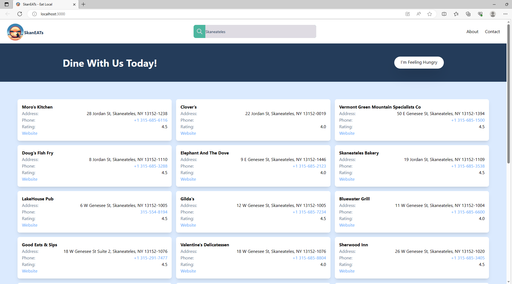

# Lettuce Deliver

## Description

LettuceDeliver is an eco-friendly, market disrupting app that allows users to search for restaurants and eateries around the world or on their doorstep. The application uses TailwindCSS and the Framer Motion library to present a polished UI and utilises the Reverse Geo-coding and Travel Advisor API for functionality.

## Installation

This project requires you to install the node packages contained within the appplication.

Please do this running the following command:

### `npm install`

## Usage

Please enter a location and our application will popualate a list of dining establishments in the vicinity.

## Screenshots

## URL

The deployed application can be viewed at the following URL: https://skaneats.com

## Credits

The contributers to this project were:
@futjr 

## License

Business License V3
